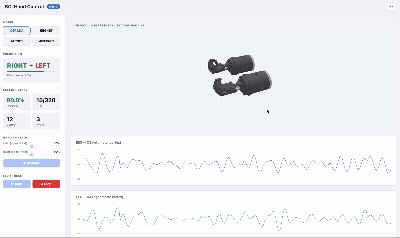
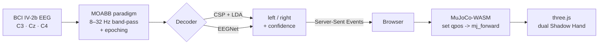

<div align="center">

# BrainHand

### Decode motor-imagery EEG into a dual robotic-hand simulation — rendered live in your browser.

*Think “left” or “right”; watch a Shadow Hand respond. No plugins, no native window — MuJoCo runs in WebAssembly.*

[](https://www.python.org/)
[](https://mujoco.org/)
[](https://threejs.org/)
[](https://flask.palletsprojects.com/)
[](./LICENSE)



</div>

---

## Abstract

**BrainHand** is an end-to-end brain–computer interface (BCI) demonstrator. It decodes
**motor-imagery** electroencephalography (EEG) — the brain activity produced when a person
*imagines* moving their left or right hand — and maps each decoded intent onto a physically
simulated [Shadow Dexterous Hand](https://www.shadowrobot.com/dexterous-hand-series/).

Four decoding pipelines are provided, from a classical **Common Spatial Patterns + LDA**
baseline to the deep **EEGNet** convolutional network. Predictions stream to the browser over
Server-Sent Events, where the **entire physics simulation runs client-side** — MuJoCo compiled
to WebAssembly, rendered with three.js. The approach mirrors Google Research’s
[robopianist](https://github.com/google-research/robopianist) web demo, applied to neural decoding.

Evaluation follows the **official BCI Competition IV-2b session-holdout protocol** (train on the
first three sessions, test on the last two) — no cross-session leakage, honest numbers.

---

## Highlights

- **Browser-native physics** — MuJoCo-WASM + three.js render two 24-DOF Shadow Hands at 60 fps. Nothing installed on the viewer’s machine; forward kinematics are solved in the browser.
- **Four decoders, one interface** — hot-swap CSP+LDA, EEGNet, and two research placeholders live from the UI.
- **Real EEG, real protocol** — BCI Competition IV dataset 2b via [MOABB](https://neurotechx.github.io/moabb/); leakage-free session hold-out.
- **Live neural traces** — C3 / C4 motor-cortex channels scroll in real time next to the hands.
- **Reproducible & self-contained** — models train on first run and cache to disk; the WASM scene auto-exports from the MuJoCo model.

---

## How it works



The Python backend (`app.py`) loads the dataset, trains/loads the decoders, and streams
per-trial predictions. The browser (`static/sim.js`) owns the simulation: each decoded intent
triggers a **fist -> open -> fist** animation on the corresponding hand, solved kinematically by
writing joint angles (`qpos`) and calling `mj_forward` every frame.

---

## Results

Subject 1, official session hold-out (train: sessions 0–2, test: sessions 3–4 · **n = 320** test trials).
Two EEG channels feed the classical pipeline (C3, C4); accuracy is leakage-free.

| Decoder | Type | Test accuracy |
|--------|------|:---:|
| **EEGNet** | Compact CNN (braindecode) | **68.1 %** |
| **CSP + LDA** | Common Spatial Patterns + Linear Discriminant | **65.0 %** |
| ATCNet | *placeholder — random predictor* | 45.9 % |
| MIRepNet | *placeholder — random predictor* | 54.1 % |

> **Honesty note.** ATCNet and MIRepNet are stubs (random predictors) kept as extension points —
> they are **not** real implementations, and their scores reflect chance. CSP+LDA and EEGNet are
> full implementations. Numbers are single-subject and will vary across the nine subjects in the
> dataset; the point of this repo is the end-to-end pipeline, not a leaderboard.

### EEGNet — a closer look

The headline 68.1 % is honest balanced accuracy (the test set is 160/160), but it hides a
**strong left-hand bias**. Per-class breakdown on the held-out sessions:

| true \ pred | left | right | recall |
|---|:---:|:---:|:---:|
| **left**  | 159 | 1  | **99 %** |
| **right** | 101 | 59 | **37 %** |

The network decodes left-imagery almost perfectly but recovers right-imagery barely above a coin
flip, predicting "left" for 260 of 320 trials. It still extracts real signal (68 % balanced > 50 %
chance), so it is genuinely learning — but it is **not** a polished decoder. Contributing factors:

- **Overfitting** — 87 % train vs 68 % test, with no regularization or early stopping on only 400 training trials.
- **No input normalization** — raw EEG is fed directly; braindecode pipelines normally standardize per channel.
- **Cross-session shift** — the test sessions differ from the training sessions, nudging the decision boundary toward one class.

Known next steps: per-trial standardization, dropout / early stopping, a tuned learning rate, and
class-balanced training. Contributions welcome.

---

## Getting started

```bash
# 1. Install dependencies (PyTorch, MOABB, MNE, MuJoCo, Flask, …)
pip install -r requirements.txt

# 2. Run
python app.py
```

Open **`http://127.0.0.1:5000`** in a modern browser.

> **macOS:** use `127.0.0.1`, not `localhost` — port 5000 is claimed by the AirPlay Receiver.

**First run** downloads the EEG dataset via MOABB (~1.2 GB, cached in `data/`), trains CSP+LDA and
EEGNet (cached in `trained_models/`), and exports the WASM scene to `static/model/`. Subsequent
runs load everything from disk and start in seconds.

Then: pick a decoder, hit **Start** to stream trials, or drag the **Hand Control** sliders /
**Animate** to drive the hands by hand.

---

## Project layout

```
brainhand/
├── app.py                     Flask server · SSE prediction stream
├── pipeline/
│   ├── data_loader.py         MOABB loader · session-holdout split
│   └── models/
│       ├── base.py            abstract Model: train / predict / save / load
│       ├── csp_lda.py         MNE CSP + scikit-learn LDA          (full)
│       ├── eegnet.py          braindecode EEGNetv4                (full)
│       ├── atcnet.py          random-predictor placeholder
│       └── mirepnet.py        random-predictor placeholder
├── simulation/
│   └── hand.py                dual Shadow Hand MjSpec -> scene.xml + meshes
├── templates/index.html       single-page UI
└── static/
    ├── main.js                SSE client · Chart.js EEG traces
    ├── sim.js                 MuJoCo-WASM + three.js hand viewer
    ├── wasm/                  vendored mujoco_wasm build (MuJoCo -> WebAssembly)
    ├── vendor/three/          vendored three.js + OrbitControls
    └── model/                 exported scene.xml + OBJ meshes (auto-generated)
```

---

## Technical notes

**Why WebAssembly?** The original prototype opened a native MuJoCo desktop window. To make the
demo shareable — one URL, zero install — the physics were moved into the browser. `simulation/hand.py`
attaches the left and right Shadow Hand into a single `MjSpec` and serialises it to a self-contained
`scene.xml` plus OBJ meshes. On the client, `mujoco_wasm` parses that into a model, and `static/sim.js`
reconstructs the geometry as three.js meshes, driving them each frame with `mj_forward`.

**Version parity matters.** The scene is written by MuJoCo 3.x (Python), so the vendored WASM build
must also be MuJoCo 3.x — older builds crash on the newer XML schema. The exporter also strips the
`content_type` mesh attribute for maximal loader compatibility.

**Decoding.** EEG is band-pass filtered to 8–32 Hz (the μ/β motor rhythms) by the MOABB paradigm.
CSP learns spatial filters that maximise variance contrast between left- and right-imagery, feeding
log-variance features to LDA. EEGNet learns spatio-temporal filters end-to-end.

---

## Credits & licenses

This project stands on excellent open-source work:

| Component | Author | License |
|-----------|--------|---------|
| [MuJoCo](https://mujoco.org/) | Google DeepMind | Apache-2.0 |
| [mujoco_wasm](https://github.com/zalo/mujoco_wasm) | @zalo | MIT |
| [MuJoCo Menagerie](https://github.com/google-deepmind/mujoco_menagerie) — Shadow Hand model | Google DeepMind / Shadow Robot | Apache-2.0 |
| [three.js](https://threejs.org/) | three.js authors | MIT |
| [MOABB](https://github.com/NeuroTechX/moabb) | NeuroTechX | BSD-3 |
| [braindecode](https://braindecode.org/) (EEGNet) | braindecode authors | BSD-3 |
| BCI Competition IV — dataset 2b | Graz BCI Lab | research use |

The concept is inspired by [robopianist](https://github.com/google-research/robopianist)
(Zakka et al.).

---

## License

Released under the [MIT License](./LICENSE) © 2026 Michael Stöhr.
Vendored third-party assets retain their original licenses (see table above).

## Citation

```bibtex
@software{brainhand2026,
  author  = {Stöhr, Michael},
  title   = {BrainHand: In-browser motor-imagery EEG decoding to a
             MuJoCo Shadow Hand simulation},
  year    = {2026},
  url      = {https://github.com/michaelsthr/brain-hand}
}
```

<div align="center">
<sub>Built with MuJoCo · three.js · PyTorch · MOABB — decoding thought into motion.</sub>
</div>
